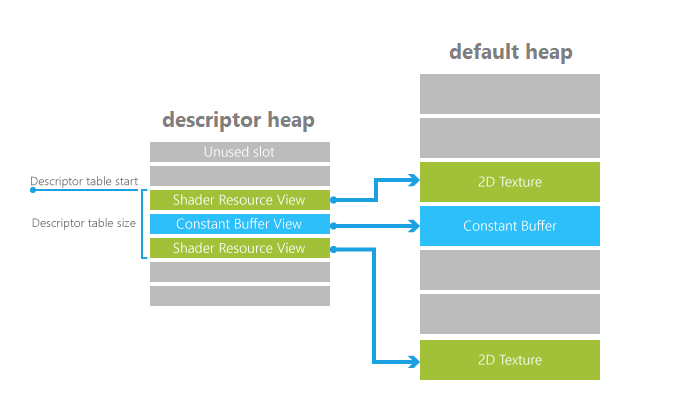

---
tags:
  - DirectX12
---

# Descriptors
Documentation about usage of descriptors.  
[Docs](https://learn.microsoft.com/en-us/windows/win32/direct3d12/descriptor-tables)

Three main parts

1. Descriptor heaps
2. Desciptors
3. Descriptor tables

### Descriptor Tables:

## Advanced Usage
[Advanced usage docs](https://learn.microsoft.com/en-us/windows/win32/direct3d12/advanced-use-of-descriptor-tables)
- Dynamic indexing
- Descriptor table versioning
